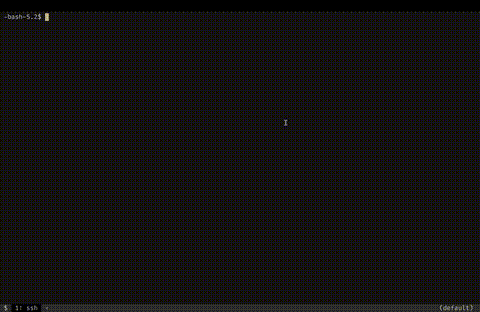

<!-- TO README.pt.md
title=$(grep "^title:" README.pt.in.md | sed "s/title:[ ]*\"\(.*\)\"/\1/")
author=$(grep "^author:" README.pt.in.md | sed "s/author:[ ]*\"\(.*\)\"/\1/")
today=$(date +"%b %d, %Y");
pandoc README.pt.in.md -t gfm --wrap=none -o ../README.pt.md
sed -i -e "/^---\$/,/^---\$/d" -e "1i# $title\\n\\n**Autor: $author**\\n**Data: $today**\\n" ../README.pt.md
sed -i 's|\](../|\](./|g' ../README.pt.md
unset title author today
-->

<!-- TO README.pt.pdf
sed '/^# TL;DR/,$d' README.pt.in.md | pandoc -o README.pt.pdf
-->

$$
\Large
\begin{array}{ll}
G: & \text{Guilherme's} \\
S: & \text{Shitty} \\
O: & \text{Operating} \\
S: & \text{System} \\
\end{array}
$$

# Sobre o que é este artigo

Este artigo foi escrito para descrever minha experiência ao criar uma distribuição Linux, mais precisamente o GSOSLinux (Tosco ("Shitty"), não devido à qualidade, mas à falta de usabilidade), seguindo o guia [Linux From Scratch](https://www.linuxfromscratch.org). Eu não tinha nenhuma experiência anterior na construção de kernel do zero, me limitando a, por exemplo, instalações do [ArchLinux](https://archlinux.org). Embora os resultados não sejam revolucionários, nem o sistema esteja pronto para uso diário, acredito que todos que trabalham com sistemas Linux provavelmente deveriam passar por essa experiência pelo menos uma vez em sua carreira de desenvolvimento.

# Quem é você e por que eu deveria me importar?

Olá, meu nome é Guilherme, sou brasileiro, estudante de Ciência da Computação e trabalho como estagiário no ramo da engenharia de software. Comecei a usar Linux quando entrei na universidade, por volta de 2022. Sempre fui uma pessoa muito antenada na área da tecnologia, mas essa mudança me fez perceber o quão vasto é o mundo da tecnologia e que, apesar de todo o conhecimento que acumulamos como indivíduos ao longo dos anos, somos incapazes de sequer enxergar a ponta do iceberg do que as pessoas que vieram antes de nós descobriram neste campo.

Embora não me considere um especialista na área de engenharia de sistemas, acho que este artigo será uma leitura valiosa para pessoas que nunca adentraram nesse tipo de coisa, têm medo de quebrar seus computadores e acham que não são capazes de fazer coisas legais em suas máquinas sem ter que depender de conceitos de alto nível.

Hoje em dia, as pessoas com que eu convivo geralmente estão muito pouco interessadas em assuntos de baixo nível, preferindo coisas mais populares, como a Inteligência Artificial ou desenvolvimento Web. Com este artigo, meu principal objetivo é fazer com que mais pessoas se interessem não apenas pelo sistema Linux, mas também por saber como seus computadores funcionam, o que para mim foi como fazer com que algo que eu achava mágico não parecesse mais tão místico.

# Como tudo começou

Este é meu último ano na universidade. Por isso, tive que escolher um projeto para concluir o curso. Como alguém que adora aprender sobre Linux, tive que escolher algo nesse sentido. Então foi isso que fiz. O projeto começará em agosto deste ano e envolverá mexer no kernel para obter um sistema com melhor desempenho. Mas não é disso que trata este artigo. Estou aqui para contar o que fiz para me preparar para este projeto, a estratégia que usei para conhecer melhor a ferramenta com a qual trabalharei nos próximos 12 meses.

> “Linux From Scratch (LFS) é um projeto que fornece instruções passo a passo para construir seu próprio sistema Linux personalizado, inteiramente a partir do código-fonte.”[^1]

Eu conheci esse projeto como uma brincadeira. Depois de trocar de distribuição mil vezes e finalmente conseguir instalar o Arch pela primeira vez, um dos meus amigos me mostrou o site do LFS, dizendo que isso seria o próximo passo: “Se você acha que sabe muito sobre Linux, por que não tenta montá-lo do zero você mesmo? tranquilo, né?” Não foi exatamente isso que ele disse, mas vamos ficar com essa versão para fins dramáticos. Eu realmente não achava que estava à altura do desafio, achava que estava muito acima do meu nível, então tive que deixar o projeto em espera por enquanto, com medo de não conseguir realizar a tarefa. Depois de ficar um pouco mais confortável em mexer no meu sistema operacional e me motivar com meu último projeto da faculdade, decidi retomá-lo, e estou feliz por ter feito isso.

Antes de fazer isso, porém, enfrentei um contratempo que provavelmente deixaria muitas pessoas relutantes em continuar com tal projeto: meu computador quebrou. Durante uma viagem ao exterior, tive a oportunidade de comprar um computador Apple, algo que estava muito acima do meu orçamento aqui no Brasil. Embora eu tenha gostado do que o MacOS tinha a oferecer (não sou um purista do Linux, nem odeio sistemas comerciais), algumas coisas que eu podia fazer no Linux definitivamente me deixaram no desejo por mais controle, e foi aí que descobri o [Nix](https://nixos.org/) (calma, não estou aqui para elogiar o Nix e dizer por que todos deveriam começar a usá-lo). O Nix é incrível, ele oferece a flexibilidade de alterar a configuração de software do seu sistema mais rápido do que qualquer outro gerenciador de pacotes, mas isso é assunto para outra hora.

Agora, voltando à nossa história, depois de descobrir as maravilhas da Nixlândia e usar sua distribuição no meu computador de trabalho, decidi tornar meu Mac mais flexível e “parecido com o Linux”. Antes disso, porém, eu queria restaurá-lo para as configurações de fábrica, porque o Nix mexe com os diretórios privilegiados do computador, e misturar o que é Nix com o que não é geralmente não é uma boa ideia. A Apple não gostou muito da minha idea. Depois de selecionar o botão de restauração (usando os mecanismos de restauração da própria Apple), a tela ficou preta e o computador deu pau. Tentei consertá-lo sozinho (aliás, você precisa de outro Mac para consertar um Mac), mas sem sucesso. Tive que ir ao suporte da Apple e pedir para eles resolverem o problema. Embora estivesse preocupado em ter perdido meu computador (que com certeza não poderia comprar outro tão cedo), sabia que continuaria mexendo em computadores no futuro e, por não ter sido minha culpa, não deveria nem me preocupar com isso. Resultado: eles simplesmente desconectaram a bateria física e a colocaram de volta. Tudo voltou ao normal depois disso.

A mensagem que eu queria transmitir com essa história é que você não deve ter medo de explorar tudo o que sua máquina tem a oferecer. Claro, algumas perdas acontecerão ao longo do caminho (eu perdi um Nintendo DS por causa disso), mas no final das contas, o conhecimento que você adquire com essas experiências geralmente é muito mais valioso do que os problemas que você enfrentará.

# A jornada começa com flocos

Decidi continuar minha jornada com o LFS. A primeira coisa que você precisa fazer é ter um sistema base para compilar os primeiros programas do seu novo sistema, para realizar um processo chamado compilação cruzada (cross compiling) (basicamente, uma máquina $M_a$ compila programas que funcionam em outra máquina, $M_b$, para que $M_b$ possa então usar para compilar coisas para si mesma nativamente). então usei o PC que eu tenho em casa (que foi sujeito a muitas atrocidades durante meus outros pequenos experimentos) com um sistema operacional recém-instalado para esse fim. Para isso, fiz o que muitas pessoas na comunidade alertam para não fazer e tentei usar uma distribuição Linux não convencional, chamada NixOS, como sistema base.

Isso é uma má ideia, não faça isso. Embora o Nix seja ótimo (juro que não queria tocar nessa tecla de novo), ele torna a compilação e a instalação de software Linux do zero uma tarefa muito mais complexa, porque as pessoas que empacotaram esses programas consideraram algumas coisas como pré-requisitos, coisas que o Nix alterou drasticamente para tornar seu sistema mais voltado para atingir seus próprios objetivos. Durante minha primeira tentativa, a maioria das instalações falhou devido a algumas dessas personalizações, me forçando a recomeçar tudo em outra distribuição “normal”. Depois de tentar um pouco mais, decidi desistir dessa ideia e mudei para o ArchLinux.

# Continuando, da maneira normal

Muitas pessoas evitam o Arch. É claro que ele não é tão fácil de instalar quando comparado a outras distribuições populares, como o [Ubuntu](https://ubuntu.com) ou o [PopOS](https://system76.com/pop). Não ter um instalador gráfico é algo que causa receio em muitos. Mas, mesmo não sendo amigável para iniciantes, acho que é um passo necessário para entrar no mundo do Linux. Não é tão difícil quanto parece, e você sairá dessa experiência com muito mais conhecimento sobre como o Linux funciona. Reserve um fim de semana e um computador antigo para experimentá-lo. Recomendo [este](https://youtu.be/CX67oR5GjRc?si=Ye4O5uBOK2hfp3Vv) guia de instalação, que fornece um passo a passo abrangente que acho que a maioria das pessoas não terá que quebrar a cabeça para seguir.

Voltando o assunto, vamos entrar em mais detalhes sobre o lado LFS das coisas. Como afirmado anteriormente, a primeira parte envolve baixar vários pacotes para compilar em seu novo sistema. Essa parte é realmente tediosa, mas direta. Basta seguir o guia e copiar e colar os comandos exatamente como são mostrados. Uma coisa importante que preciso observar é: não tenha pressa. Sei que nós somos curiosos, fazendo com que queiramos alcançar nossas expectativas o mais rápido possível, mas vá com calma, leia sobre o que você está fazendo (essa é a coisa mais importante que o LFS tem a oferecer) e relaxe; vai levar muito tempo para compilar tudo.

# Problemas vão acontecer e o papai IA não estará lá para ajudá-lo

Não odeio IA, [ML](https://pt.wikipedia.org/wiki/Aprendizado_de_máquina) nem [LLM’s](https://pt.wikipedia.org/wiki/Modelos_de_linguagem_de_grande_escala), uso-os quase que diariamente para me ajudar a resolver os meus problemas. Mas sei que não são perfeitos e que definitivamente não podem resolver tudo. As pessoas geralmente depositam muita confiança nessas complexas caixas pretas de álgebra linear. Uma coisa que sei com certeza é que elas vão te ajudar muito mais se você souber o que está fazendo. A IA tem um problema que os usuários tendem a esquecer: ela é muito enviesada em relação ao prompt. Se você pedir para ela construir uma casa usando um travesseiro como martelo, ela tentará fazer exatamente isso da melhor maneira possível. Afinal, foi para isso que ela foi criada.

Aqui, eu era um amador (quase) completo. Os processos de compilação variam de programa para programa e as coisas ficam escondidas dentro do código-fonte de compilação. As versões dos programas que você está compilando são importantes, a versão daquilo de que eles dependem é importante e, o mais importante, a configuração do sistema básico na máquina que você está usando é importante.

Um problema específico que encontrei foi: ao compilar o [Bash](https://pt.wikipedia.org/wiki/Bash) (uma shell que permite a interação entre o usuário e o sistema), o processo de compilação falhou. Seguindo a sugestão mais simples de solução de problemas, comecei novamente do zero, e a essa altura já tinha investido quase o dia inteiro nessa execução. Tranquilo, tentei de novo, e de novo, e de novo... O mesmo problema. Era tão frustrante passar horas em uma execução que não levava a nada. É claro que as coisas ficaram mais rápidas e mecânicas quando comecei a repetir a mesma coisa, mas a compilação leva tempo, e passar esse tempo esperando por nada deixa você realmente estressado.

Decidi investigar a mensagem de erro e ver o que estava errado. Copiar o erro para a IA só piorou as coisas. Ela sugeriu fazer alterações diretamente em algumas flags de compilação e até mesmo alterar o código-fonte do Bash (não faça isso, pois é provável que você danifique o sistema mais tarde). Depois de tentar todas essas sugestões e falhar todas as vezes, fiz uma pausa e passei a procurar as respostas para os meus problemas na internet. Depois de encontrar uma possível solução em uma página obscura sobre um firmware de roteador de internet open source aleatório e a mesma coisa em algum fórum de tech nas últimas páginas do Google, eu só precisei alterar uma flag do compilador para um padrão específico `--std=gnu17`. Quando tentei aplicar as alterações... nada aconteceu. O [Make](https://www.gnu.org/software/make), a ferramenta de compilação usada para a maioria dos programas no LFS, mostra cada comando que está sendo executado. As chamadas de compilação pareciam ignorar minhas alterações; cheguei até a alterar todas as chamadas do compilador para usar esse padrão, mas ele continuou me ignorando. Resumindo, [Grep](https://pt.wikipedia.org/wiki/Grep) e [Find](https://pt.wikipedia.org/wiki/Find) se tornaram meus melhores amigos durante essa solução de problemas. Descobri que outros scripts de compilação estavam sendo executados e que as alterações que eu precisava aplicar estavam em um desses scripts secundários. Portanto, a lição aprendida aqui foi: às vezes, a solução para seus problemas não está na cara, então quanto mais você entender o que está acontecendo nos bastidores, mesmo que isso às vezes exija muito investimento de tempo, mais fácil será obter as respostas que você está procurando.

Outra conclusão a que cheguei ao ter que repetir as mesmas coisas várias vezes foi: os scripts existem e economizam muito tempo. Ironicamente, o Bash me ajudou nessa questão. Ele permite criar scripts para automatizar comandos usando a linguagem shell e é muito poderoso, então use-o à vontade. Este repositório contém alguns dos scripts que usei para me ajudar. Eles podem não funcionar para você se decidir embarcar nessa jornada, mas podem servir como base para suas modificações de acordo com suas necessidades. Uma coisa importante que você precisa levar em consideração é tentar fazer as coisas manualmente no início para aprender; só então você deve confiar na automação, isso o ajudará a depurar os problemas à medida que eles ocorrem e evitar danos ao sistema.

# O que aprendi sobre o Linux

O Linux não é o sistema operacional completo, compilar e configurar o kernel certamente não foi a parte mais demorada do guia LFS. Os programas são o que fazem o sistema operacional ter a aparência e o funcionamento que tem. É aí que o [GNU](https://www.gnu.org) entra em cena. Tenho certeza de que algumas das pessoas que estão lendo isso não gostam do homem por trás dele, devido às controvérsias das quais ele faz parte. No entanto, uma coisa é certa: essa organização deu um passo importante para tornar o Linux tão popular como é hoje e, sem ela, tenho certeza de que o cenário do [software de código aberto](https://pt.wikipedia.org/wiki/C%C3%B3digo_aberto) seria muito diferente.

Falando mais sobre a importância do software não relacionado ao kernel. Funcionalidades básicas como segurança, rede, gerenciamento de identidade, interfaces de console e muito mais são de responsabilidade desses programas. Conhecê-los e sua importância foi um grande passo para descobrir como meu sistema funciona, e agora poderei usá-los mais diretamente para controlar meu sistema operacional com mais precisão, fazendo-o funcionar da maneira que eu quero. Mas ainda estou nessa fase de descoberta, então vou evitar entrar em território sobre o qual ainda sei pouco.

# Consegui, construí o Linux do zero! E agora?

Se você realmente decidiu seguir em frente e conseguiu construir seu próprio sistema, parabéns! Tenho certeza de que você gostou dessa jornada tanto quanto eu e berrou de alegria quando conseguiu inicializá-lo com sucesso. Mas e agora? Você tem um sistema mínimo que mal funciona, sem nenhum recurso para uso diário. Embora pareça que houve poucos ganhos concretos com essa experiência, gostaria que você se lembrasse de que a jornada foi muito mais importante do que o destino. Se você deseja continuar trabalhando nesse sistema, existe o [BLFS (Beyond Linux From Scratch)](https://www.linuxfromscratch.org/blfs). Ele ajudará você a transformar seu sistema em algo mais utilizável. Quanto a mim, continuarei com meu projeto da faculdade e espero alcançar resultados ainda melhores.

Espero que você tenha gostado da leitura e esteja mais animado para experimentar o LFS. Se precisar de ajuda, entre em contato comigo por qualquer rede social. Estamos nisso juntos e farei o possível para ajudá-lo. É isso, pessoal!

[^1]: [Linux From Scratch](https://www.linuxfromscratch.org/)

# TL;DR

Eu criei uma distribuição Linux e ela roda DOOM.

